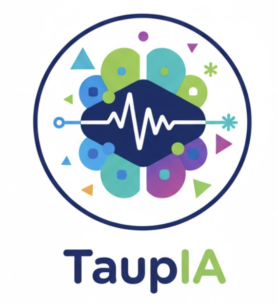
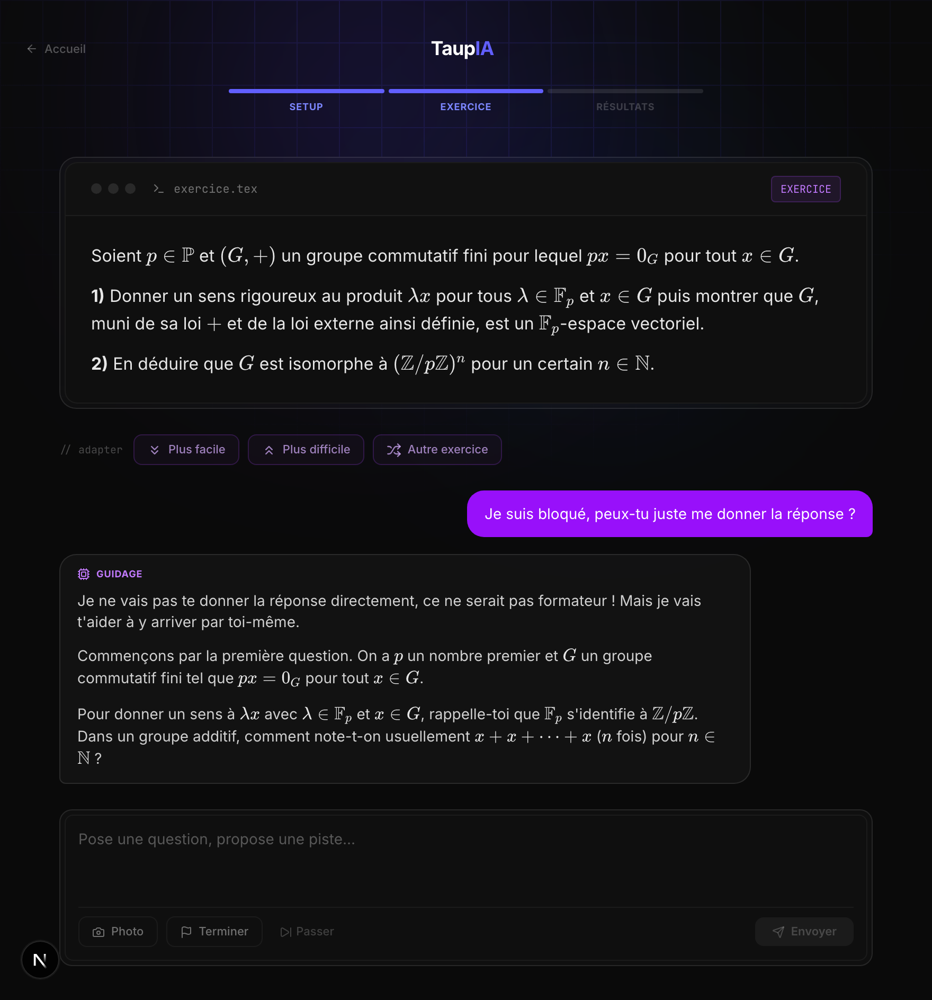
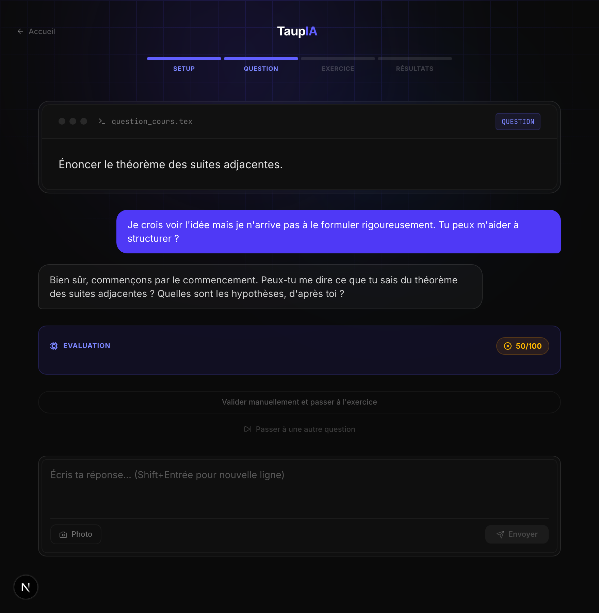
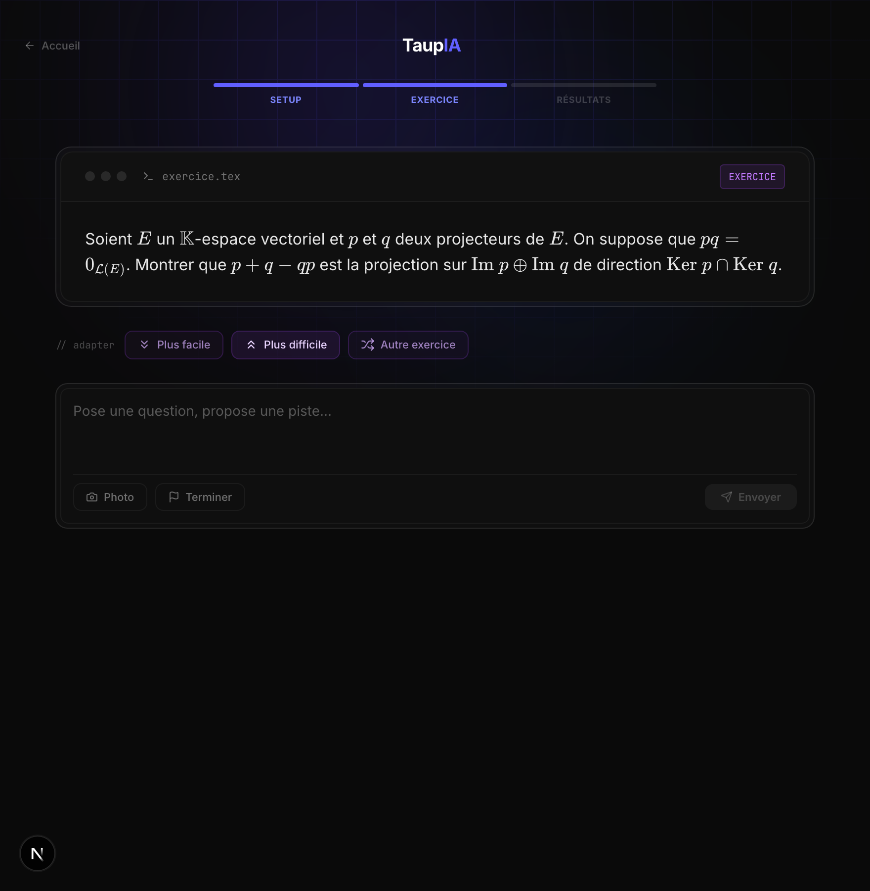

<div align="center">



# TaupIA

**An AI oral-exam examiner for French _prépa_ maths students.**
It challenges you, makes you reason, and gives structured feedback — it never hands over the answer.

[](https://github.com/LoicLang/kholleur-ai/actions/workflows/tests.yml)
[](LICENSE)
[](.python-version)
[](frontend)
[](https://taupia.vercel.app)

</div>

> **khôlle** (n.f.) — a weekly oral exam in French preparatory classes (_classes préparatoires_).
> A student reasons out loud at the blackboard while an examiner probes their understanding.
> TaupIA simulates that examiner.

---

## Why I built it

I tutor maths, up to _prépa_ level. When ChatGPT reached my students, I watched it get used the
worst possible way: as an **answer machine**. Stuck on a problem? Paste it, copy the solution,
move on. The reasoning — the one thing that actually builds a mathematician — got skipped
entirely. AI was an extraordinary lever, pointed backwards.

TaupIA is that lever turned the right way round: the same models, used to **make a student
reason instead of doing the reasoning for them**. It's an examiner that never gives you the
answer — it challenges you, asks _"what do you notice in the statement?"_, and guides with
questions, exactly like a real khôlle. Demanding, patient, available any time.

That's also a conviction about where AI belongs in education: not replacing teachers, not
spoon-feeding, but making a **demanding, controllable first level of support** reachable by far
more students than the ones who can already afford private tutoring. Augment the human; don't
short-circuit them.

## See it work

These are **real, unscripted exchanges** with the live app (captured by
[`frontend/scripts/screenshots.mjs`](frontend/scripts/screenshots.mjs)).

<p align="center">
  
  
</p>

> **Left:** the student asks _"I'm stuck, just give me the answer"_ — the examiner refuses
> (_"that wouldn't help you progress"_) and scaffolds with a precise question.
> **Right:** a demanding, honest evaluation (50/100) followed by a guiding question, not a lecture.

<p align="center">
  
</p>

> The student stays in control: ask for a harder exercise and the agent **switches it on the
> fly** (an agent _action_, not a fixed flow). [Live demo →](https://taupia.vercel.app)

## What it does

1. **Pick a chapter** (29 MPSI chapters) and a format — full khôlle (course question → exercise)
   or exercise-only.
2. **Answer** by typing, or by **photographing handwritten work** (OCR).
3. **Get Socratic feedback.** TaupIA never hands you the method; it probes until the reasoning
   holds, and only nudges once you're genuinely stuck.
4. **Move to a matched exercise** practising the same concepts, found by walking the knowledge graph.

The examiner is grounded in the **official MPSI programme** and an exact course knowledge base,
so it evaluates against the real definitions and theorems — not its own approximation of them.

## How it works


The **kholleur is an agent**: it's given the Socratic system prompt and a set of **tools** over
the knowledge graph, and decides on its own to look up the exact definition it's grading against,
check a theorem, find the prerequisites a stuck student is missing, pull a matching exercise, or
— with deviation enabled — switch the exercise the student asked to change.

The graph is the backbone: **4,705 nodes** (29 chapters, 1,902 concepts, 1,536 exercises, 1,238
khôlle questions) connected by **~12,900 edges** — `TESTS` (which questions/exercises test which
concepts), `BELONGS_TO`, `APPLIES_METHOD`, and `REQUIRES` (prerequisite chains).

## The build

TaupIA grew from a weekend RAG script into an agent over a curated knowledge graph. The decisions
worth defending — each one written up as an [ADR](docs/adr):

**RAG → knowledge graph.** It started as plain RAG over course PDFs (ChromaDB + embeddings). That's
probabilistic where an examiner must be exact: you grade against _the_ definition, not the
nearest paragraph. So the data layer became a **deterministic graph** — questions link to the
exact concepts they test, exercises are matched by concept intersection.

**The examiner is an agent, not a prompt.** Instead of stuffing a fixed context window, the LLM
gets tools (`lire_definition`, `lire_theoreme`, `trouver_prerequis`, `chercher_exercice`, …) and
a loop (`run_agent_turn`) with a max-iteration cap and a graceful fallback for providers without
tool support. Verified working end-to-end on a non-Claude provider.

**A real prerequisite graph — generated, not guessed** ([ADR 0001](docs/adr/0001-concept-prerequisite-enrichment.md)).
The graph had _zero_ concept→concept prerequisites, so remediation was dead code. Pure heuristics
would be plausible-but-unreliable; a naive LLM hallucinates non-existent nodes. So the enrichment
pipeline **grounds** the LLM in real candidate concepts, has it _select_ prerequisites, then runs
an **independent adversarial verifier** that tries to refute each edge — only survivors are kept,
with deterministic guardrails (DAG, ordering) on top. Result: **462 verified edges across 6 core
chapters**, generated for ~1.9M tokens, ~4.4× cheaper after batching + tiering models. The agent
can now walk _rank theorem → linear map → vector space → group_ to find what a student is really
missing.

**Steerable + personalised** ([ADR 0002](docs/adr/0002-agent-navigation-and-mastery.md)). Action
tools let the student change exercise on demand (the agent records an _intention_ the backend
applies, keeping the domain layer decoupled). A per-concept **mastery** profile, updated from each
score, reweights remediation toward the gap that is _both_ required _and_ weakly mastered.

**Cross-cutting:** a provider-agnostic `LLMProvider` Protocol (Claude / Gemini / DeepSeek / Kimi,
one tool schema for all four — born from real experimentation on my students' handwriting);
**externalised prompts** (`prompts/*.txt`) so the pedagogy is iterable without a redeploy; and
**in-memory JSON over a vector DB** — for a fixed 4,705-node curriculum, vectors would be slower,
opaque overhead. Pragmatism over hype.

## Tech stack

| Layer | Choice |
|-------|--------|
| Backend | Python 3.12, FastAPI, Pydantic v2 |
| Frontend | Next.js 16, React 19, TypeScript, TailwindCSS v4 |
| LLM | DeepSeek / Claude / Gemini / Kimi (pluggable) |
| OCR | Kimi / Gemini (pluggable) |
| Data | In-memory JSON knowledge graph (no vector DB) |
| Auth | Clerk (PyJWT verification, conditional) |
| Deploy | Railway (backend) · Vercel (frontend) |

Clean / hexagonal layering: `core/` (domain, zero external deps) → `infrastructure/` (LLM & OCR
adapters) → `application/` (DI container, facade) → `backend/` (FastAPI) and `frontend/` (Next.js).

## Getting started

**Prerequisites:** Python 3.12, Node.js 20+, at least one LLM API key.

```bash
# 1. Backend
python3.12 -m venv venv && source venv/bin/activate
pip install -r requirements.txt
cp .env.example .env          # add at least one LLM API key
uvicorn backend.main:app --reload   # http://localhost:8000

# 2. Frontend (second terminal)
cd frontend && npm install && npm run dev   # http://localhost:3000
```

Auth is **disabled locally** when no Clerk key is set. Set `ALLOW_DEVIATION=true` to enable the
agent's exercise-switching and mastery features (off in production).

## Running the tests

```bash
python -m pytest tests/unit/ -v        # 78 tests, no API key needed (providers mocked)
```

Coverage: graph traversal & data loading, the concept-prerequisite overlay, the LLM provider base
(retry, truncation, evaluation parsing), the agent tool-use loop, navigation/mastery, entities,
and the DI container.

## Project layout

```
core/            # Domain: entities, interfaces (Protocols), agent tools — no deps
infrastructure/  # LLM + OCR provider adapters
application/      # Settings, DI container, AI service facade
services/         # KnowledgeService: in-memory graph + traversal
backend/          # FastAPI app, routes, auth, session store
frontend/         # Next.js 16 app (setup → question → exercise → results)
prompts/          # Externalised system prompts (.txt)
data/             # Knowledge graph, curriculum JSON, derived prerequisite overlays
scripts/          # Enrichment pipeline + screenshot tooling
docs/adr/         # Architecture decision records
tests/unit/       # Tests
```

## Status — production vs this branch

- The **deployed MVP** ([taupia.vercel.app](https://taupia.vercel.app), Railway + Vercel + Clerk)
  proves the product end-to-end. It's invitation-only (Clerk waitlist) and unmarketed by design —
  run it locally for unrestricted access.
- The **agentic evolution** in this README (examiner-as-agent, the generated prerequisite graph,
  deviation, mastery) lives on the `chore/public-showcase-cleanup` branch **behind feature flags
  and is not yet in production** — shipping it is a deliberate next step, not a silent deploy.
- Content is **MPSI maths only**; the interface and pedagogy are in French.
- Next: enrich the remaining chapters, durable per-user mastery (cross-session personalisation),
  and broadening beyond MPSI.

## License

[MIT](LICENSE). The MPSI programme data derives from the French Ministry of Education's official
programme (public). Course and exercise content is provided for educational use.
