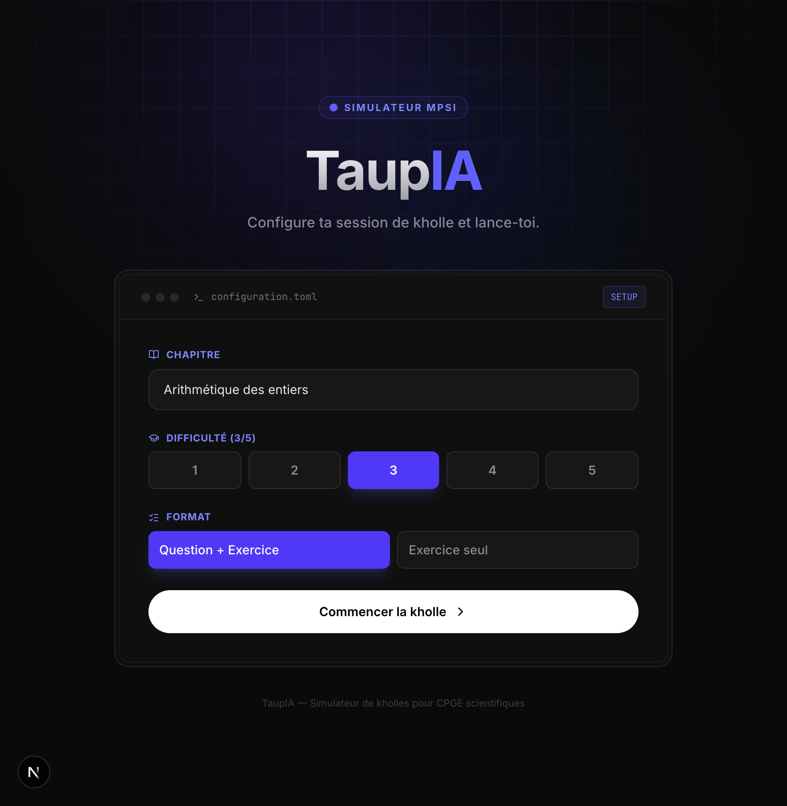
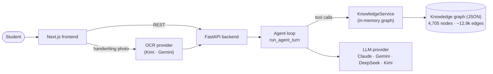

<div align="center">


# TaupIA

**An AI oral-exam examiner for French _prépa_ maths students.**
It challenges you, makes you reason, and gives structured feedback — it never lectures.

[](LICENSE)
[](.python-version)
[](frontend)
[](https://taupia.vercel.app)

</div>

> **khôlle** (n.f.) — a weekly oral exam in French preparatory classes (_classes préparatoires_).
> A student is given a question or a problem at the blackboard and reasons out loud while an
> examiner probes their understanding. TaupIA simulates that examiner.

---

## The problem

I tutor maths, up to _prépa_ level. The single most useful thing I do for a student is **not**
explaining the course again — it's sitting across from them and asking _"why?"_ until the
reasoning holds. That kind of demanding, patient, one-on-one questioning is what makes the
difference before an exam.

It's also the part that doesn't scale. A khôlle is 20 minutes of one examiner's full attention.
Most students get one or two a week, if any. The students who get more — through private
tutoring — are usually the ones who can already afford it.

## What TaupIA does

TaupIA gives a student an examiner that is **available any time, infinitely patient, and
demanding in the right way**:

1. **Pick a chapter** (21 official MPSI chapters) and a format — full khôlle (course question
   → exercise) or exercise-only.
2. **Answer a course question** by typing, or by **photographing handwritten work** (OCR).
3. **Get Socratic feedback.** TaupIA never hands you the method. It asks what you noticed in
   the statement, what the hypotheses are, where the reasoning breaks — and only nudges once
   you're genuinely stuck.
4. **Move on to a matched exercise** that practises the same concepts, found by walking the
   knowledge graph.

The examiner is grounded in the **official MPSI programme** and an exact course knowledge base,
so it evaluates against the real definitions and theorems — not its own approximation of them.

## Why this matters

I believe AI is going to reshape education, and that the prize isn't a flashier model — it's
**access**. A good first level of tutoring (a tutor, a coach, someone to think a problem through
with) has always been gated by money, time, and network. Done well, AI can lower that gate:
a tutor that's always there, never impatient, and adaptable to each student.

Not by replacing teachers. Not by giving away answers. By making a useful, demanding,
**controllable** first level of support reachable by far more students than today.

TaupIA is a first, honest step in that direction: a working product, in production, that takes
a real pedagogical stance (challenge, don't spoon-feed) and is built so that stance can be
iterated on.

## Screenshots

> **Live demo:** [taupia.vercel.app](https://taupia.vercel.app) — _currently invitation-only
> (Clerk waitlist). Run it locally (below) to try it without auth._

<!-- Drop captures into assets/screenshots/ and uncomment:



-->

## How it works



A turn works like this:

1. The student's answer (typed or OCR'd) reaches the FastAPI backend.
2. The **kholleur agent** runs: the LLM is given the Socratic system prompt and a set of
   **tools** over the knowledge graph. It can decide, on its own, to look up the exact
   definition it's evaluating against, check a theorem statement, find the prerequisites a
   stuck student is missing, or pull a matching exercise — then it answers.
3. Evaluation comes back as structured feedback (score, completeness, missing points), and the
   session advances.

The knowledge graph is the backbone: **4,705 nodes** (29 course chapters, 1,902 concepts, 1,536
exercises, 1,238 khôlle questions) connected by **~12,900 edges** — `TESTS` (which questions and
exercises test which concepts), `BELONGS_TO`, `APPLIES_METHOD`, and `REQUIRES` (explicit
prerequisite chains).

## Design decisions

These are the choices I'd actually defend in an interview.

**Knowledge graph over RAG.** TaupIA started as a plain RAG pipeline over course PDFs (ChromaDB
+ embeddings). It worked, but it was probabilistic where it needed to be exact: an examiner
must evaluate against _the_ definition, not the semantically-nearest paragraph. So I rebuilt the
data layer as a structured graph (see the commit `Refonte architecture: ChromaDB → Knowledge
Graph`). Lookups are now **deterministic** — a question links to the exact concepts it tests via
`TESTS` edges, and exercises are matched by concept intersection through graph traversal. The
long-term bet is bigger: a richer graph that encodes the _teaching path_ (prerequisites,
method dependencies) and can be overlaid with a per-student mastery layer to personalise what
comes next.

**The examiner is an agent, not a prompt.** Rather than stuffing a pre-built context window and
hoping, the LLM is given **tools** (`chercher_concepts`, `lire_definition`, `lire_theoreme`,
`trouver_prerequis`, `chercher_exercice`, `lire_programme`, `choisir_question`) and a loop
(`run_agent_turn`). It queries the graph only when it needs to. The loop has a max-iteration cap
and a graceful fallback to plain text for providers without tool support.

**Provider-agnostic LLM layer.** A `LLMProvider` `Protocol` plus a `BaseLLMProvider` (template
method: shared retry/backoff, history truncation, prompt loading) sits in front of four
concrete providers — **Claude, Gemini, DeepSeek, Kimi**. Tool definitions use one
OpenAI-compatible schema that all four consume. This wasn't gold-plating: choosing the default
LLM, and the OCR model that actually reads messy handwritten maths, took real experimentation on
my own students' work — having providers be swappable made that cheap.

**Externalised prompts.** Every system prompt lives in `prompts/*.txt`, decoupled from code. The
pedagogy — how patient to be, how strict the evaluation rubric is, how aggressively to enforce
LaTeX — can be refined and redeployed without a code change. For an education product, the
prompt _is_ the product, and it should be iterable.

**In-memory JSON over a vector DB.** The whole knowledge base is ~2 MB loaded into RAM at
startup. For a fixed MPSI curriculum (4,705 nodes), a vector database would be slower, opaque,
and operational overhead for nothing. Zero latency, deterministic, human-readable. Pragmatism
over hype.

## Tech stack

| Layer | Choice |
|-------|--------|
| Backend | Python 3.12, FastAPI, Pydantic v2 |
| Frontend | Next.js 16, React 19, TypeScript, TailwindCSS v4 |
| LLM | DeepSeek / Claude / Gemini / Kimi (pluggable) |
| OCR | Kimi / Gemini (pluggable) |
| Data | In-memory JSON knowledge graph (no vector DB) |
| Auth | Clerk (PyJWT verification, conditional) |
| Deploy | Railway (backend) · Vercel (frontend) |

The codebase follows a clean / hexagonal layering: `core/` (domain entities and interfaces, zero
external dependencies) → `infrastructure/` (LLM and OCR adapters) → `application/` (DI container,
facade) → `backend/` (FastAPI) and `frontend/` (Next.js).

## Getting started

**Prerequisites:** Python 3.12, Node.js 20+, and at least one LLM API key.

```bash
# 1. Backend
python3.12 -m venv venv && source venv/bin/activate
pip install -r requirements.txt
cp .env.example .env          # then add at least one LLM API key
uvicorn backend.main:app --reload   # http://localhost:8000

# 2. Frontend (in a second terminal)
cd frontend
npm install
npm run dev                   # http://localhost:3000
```

Auth is **disabled locally** when no Clerk key is set, so you can use it straight away. The
backend reads its configuration from `.env` (see `.env.example` for every variable).

## Running the tests

```bash
python -m pytest tests/unit/ -v
```

The suite (69 tests) covers the knowledge-service graph traversal and data loading, the LLM
provider base (retry, truncation, evaluation parsing), the agent tool-use loop, the domain
entities, and the DI container. No API key is required — providers are mocked.

## Project layout

```
core/            # Domain: entities, interfaces (Protocols), agent tool entities — no deps
infrastructure/  # LLM + OCR provider adapters (base class + concrete providers)
application/      # Settings, DI container, AI service facade
services/         # KnowledgeService: in-memory graph + traversal
backend/          # FastAPI app, routes, auth, session store
frontend/         # Next.js 16 app (setup → question → exercise → results)
prompts/          # Externalised system prompts (.txt)
data/             # Knowledge graph + curriculum JSON
tools/ scripts/   # One-off data-generation / migration utilities
tests/unit/       # Tests
```

## Status & limitations

- **MVP, in production**, with few users by design — it's been pushed end-to-end (Railway +
  Vercel + Clerk) but not marketed.
- Live demo is **invitation-only** (Clerk waitlist); run locally for unrestricted access.
- Content is **MPSI maths only** (first-year _prépa_); the interface and pedagogy are in French.
- The graph's `APPLIES_METHOD` edges are populated but not yet used in queries — they're the
  foundation for method-aware practice ("show me problems that drill induction").
- Next steps: a per-student mastery layer over the graph for real personalisation, and
  broadening beyond MPSI.

## License

[MIT](LICENSE). The MPSI programme data derives from the French Ministry of Education's official
programme (public). Course and exercise content is provided for educational use.
