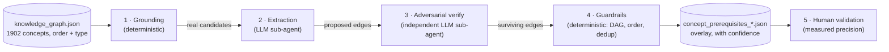

# Design: concept-level prerequisite enrichment

How TaupIA turns its chapter-only prerequisite graph into a real concept→concept
graph that the examiner agent can traverse for remediation. See
[ADR 0001](../adr/0001-concept-prerequisite-enrichment.md) for the decision and
rationale; this document is the *how*.

## The pipeline



Claude is the controller; layers 2 and 3 are fanned out across sub-agents (one per
concept), orchestrated by a workflow. Layers 1 and 4 are plain Python the
controller runs.

## Layers and their code

| Layer | What | Code |
|-------|------|------|
| 1. Grounding | Build, per load-bearing concept, the list of **real** candidate prerequisites (same-chapter earlier concepts + prerequisite-chapter concepts). | [`scripts/build_extraction_units.py`](../../scripts/build_extraction_units.py), [`scripts/get_unit.py`](../../scripts/get_unit.py) |
| 2. Extraction | An LLM sub-agent *selects* direct prerequisites from the candidates — never invents one. | enrichment workflow |
| 3. Adversarial verify | An independent skeptic sub-agent tries to *refute* each proposed edge; only survivors pass. | enrichment workflow |
| 4. Guardrails | Reject unknown ids, self-loops, order violations, duplicates, cycles. Write the overlay. | [`scripts/build_prereq_overlay.py`](../../scripts/build_prereq_overlay.py) |
| 5. Validation | A domain expert reviews a sample → precision. | `data/derived/validation_*.md` |

Only **load-bearing** concept types (`definition`, `theorem`, `property`,
`method` — 841 of 1902) are nodes in the prerequisite graph. `example`, `remark`,
and `warning` (1061) are pedagogical decoration and excluded.

## Data shapes

**Extraction unit** (per concept, served on demand by `get_unit.py`):

```json
{ "concept": {"id", "title", "type", "statement"},
  "candidates": [{"id", "title", "type", "order", "chapter_id"}, ...] }
```

**Overlay edge** (`data/derived/concept_prerequisites_<chapter>.json`):

```json
{ "source": "<concept>", "target": "<prerequisite>", "type": "REQUIRES",
  "properties": { "confidence": 0.95, "source_method": "llm_grounded_verified",
                  "extract_reason": "...", "verify_reason": "...", "generated": true } }
```

`KnowledgeService` loads every `concept_prerequisites_*.json` into
`_concept_prerequisites` (behind `enriched_graph`), exposed via
`get_concept_prerequisites(concept_id)`. The `trouver_prerequis` tool prefers these
and falls back to chapter-level prerequisites when a concept has none.

## Pilot results — `applications_lineaires`

| Metric | Value |
|--------|-------|
| Load-bearing concepts | 53 |
| Candidates per concept | avg 83 |
| Edges proposed (extraction) | 212 |
| Survived adversarial verification | **174** (38 refuted, ~18%) |
| Dropped by guardrails | 0 |

The 18% refutation rate confirms the verifier discriminates rather than rubber-
stamps — it consistently distinguished "used in the *proof*" from "needed for the
*statement*", and "downstream consequence" from "upstream prerequisite". Even the
lowest-confidence kept edges held up on expert review.

## Cost and optimisation

The pilot was deliberately unoptimised: 106 sub-agents (one extract + one verify
per concept) ≈ 2.5M tokens for one chapter. Two levers cut this ~4–6× without
touching quality:

- **Batch** ~8–10 concepts per agent, loading the chapter catalogue once instead
  of per concept.
- **Right model per step:** Claude **Haiku** for extraction (easy selection),
  a stronger tier only for the precision-critical verification.

Enrichment is a **one-time offline batch**; the committed overlay is then free at
runtime. Scope for the showcase is a **core subset (~6 interconnected chapters)** —
enough to prove the capability and demo remediation; the rest is "run the script".

## Running it

```bash
# 1. Grounding: build candidate units for a chapter
python scripts/build_extraction_units.py applications_lineaires

# 2 & 3. Extraction + adversarial verification: run the enrichment workflow
#        (Claude controller + sub-agents) over the chapter's concepts.

# 4. Guardrails + overlay from the workflow output
python scripts/build_prereq_overlay.py <workflow_output.json>
# -> data/derived/concept_prerequisites_<chapter>.json
#    data/derived/validation_<chapter>.md   (for layer 5)
```
